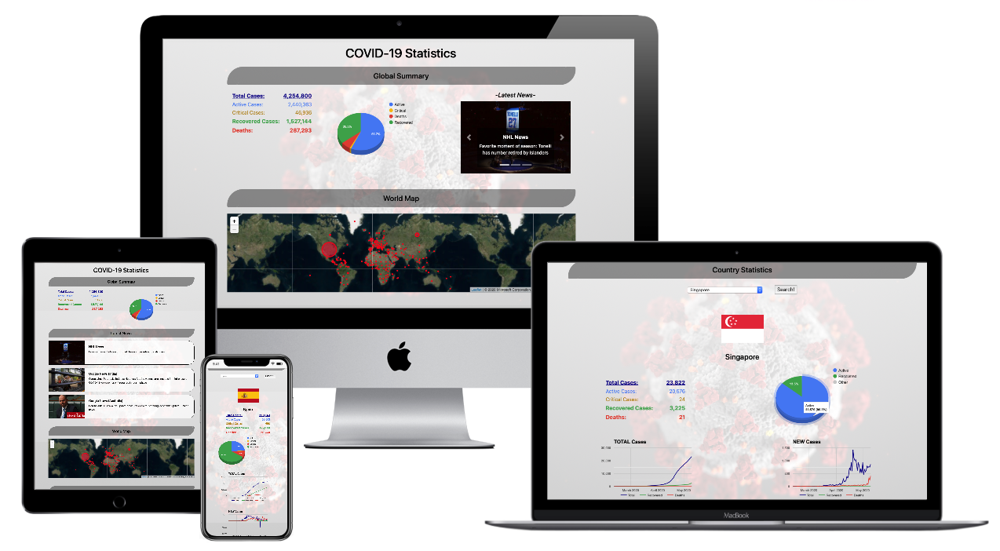

# COVID-19 Statistics
### Data Centric Development Project (Code Institute

An overview page of current global COVID-19 key statistics.

## Objective
The SARS-CoV-2 coronavirus has become a very real and severe problem globally - This highly infectious disease has already reached more than 200 countries and territories worldwide. It has brought upon immeasurable suffering and has affected the livelihood of many groups and individuals and is still spreading. 
With technology, we are now able to trace and account for most of the infected cases. This allows world leaders and organisations to keep abreast of the situation to plan and act accordingly.
The objective of this project is to provide users a quick up-to-date information source for the COVID-19 pandemic. The data has been packaged and presented in a compact manner - it allows users to get an update of the key statistics with a quick glance. Users can also select and view statistics for various countries with graphs to show historical data trends. The data and trends serve as an indication of the current spread of SARS-CoV-2 and the severity of the pandemic.

## UX
Based on the objective, this website was built for any and all users who want to have an overview of the global COVID-19 situation. The page content is kept minimal and compact, users will be able to see most of the information on a desktop screen. The key statistics are displayed in bold, along with some charts as a graphical representation of the information. 

There is also an interactive section where users can select a country of choice to view the country statistics and data trend. This option is targetted at users who want to know the situation in their local country or if they want to check out the statistics in other countries.

## UI

## Features
The webpage has the following features:
* A global summary section for global statistics and information
    1. A global statistics and numbers table for users to get an update of the number of cases globally.
    2. A pie chart to represent the ratio of deaths and recovered cases to the total no. of cases.
    3. A news column carousel with the latest news from around the globe, with links to the article source website.
    4. A map with circles indicating which country has infected cases, the circles radii representing the number of cases.
* A country statistics section for number of cases and information in user-selected country.
    1. Upon selection of country, the map will fly to the location of selected country.
    2. Country flag and name indicating selected country
    4. A country statistics and numbers table for users to get an update of the number of cases in the selected country
    4. A line graph indicating the total number of cases for each key statistic over the past 90 days for the selected country
    5. A line graph indicating the new cases per day for each key statistic over the past 90 days for the selected country

The charts and data are updated daily for users to obtain the most current information, and the charts will automatically retrieve the latest data upon loading. 

Users will be able to search more than once i.e. they are able to search for data in another country after having already searched for one. 

The circles on the map also has a popup when the mouse hovers over it. The same statistics will be shown in the popup, so users can quickly pan and zoom to view the situation in other countries.

## Technologies Used
The following programming languages and tools were used in to build the website:
* HTML 5
* CSS 
* JavaScript 
* Bootstrap v4.4 toolkit to organise the elements in the page
* jQuery library for DOM manipulation
* COVID-19 APIs for retrieving up-to-date data
* Leaflet for map display and interactions
* Bing Maps API for map layers
* Visual Studio Code for the writing of codes
* W3C Markup Validation Service for HTML and CSS validation
* Esprima for JavaScript Syntax Validator
* GitHub

## Testing
The website has been tested for viewing and responsiveness on various screen sizes, including but not limited to the following web browsers and devices:

* Apple Safari Web Browser
    1. macOS 
    2. Windows 10
    3. iOS
    4. iPadOS
* Mozilla Firefox Web Browser
    1. macOS
    2. Windows 10
    3. Android 10
* Microsoft Edge Web Browser
    1. macOS
    2. Windows 10
    3. Android 10
* Google Chrome Web Browser
    1. macOS
    2. Windows 10
    3. Android 10

- HTML, CSS validated by W3C Markup Validation
- JavaScript Syntax validated by Esprima

## Deployment
GitHub was used to hose to deploy the website, using GitHub to host the project repository. You can find the deployed website in this [link](http://zuanming.github.io/secondrepo). 

## Credits
This website was built using tools and data from various sources, including but not limited to the following:

* News API is obtained from [https://newsapi.org](https://newsapi.org). The API allows users to obtain the latest news from various sources and can be sorted by region, category etc.

* Background image was obtained from [Unsplash](https://unsplash.com/photos/w9KEokhajKw), provided by [Centers for Disease Control and Prevention (CDC)](https://www.cdc.gov).

* COVID-19 data was obtained from [NovelCOVID](https://disease.sh), featuring a free API updated every 10mins from sources such as John Hokpins University, Worldometers etc.

* Charts were generated using [Google Charts](https://developers.google.com/chart) which allows users to easily create charts of various types and is highly customizable.

* The Map was generated using [Leaflet](https://leafletjs.com), the Bing Maps Layer plugin provided by [digidem](https://github.com/digidem/leaflet-bing-layer) and the Bing Maps from [Microsoft](https://www.bing.com/maps).

* APIs were tested and verified with [Postman](https://www.postman.com) before being selected for use. 

Last but not least, to [Trent Global](https://www.trentglobal.edu.sg/diplomainsoftwaredevelopment/?gclid=EAIaIQobChMI8M3ezf6t6QIV2BwrCh2R6A44EAAYASAAEgL6__D_BwE) and [Code Institute](https://codeinstitute.net) for the teachings and support to have made this project possible. 